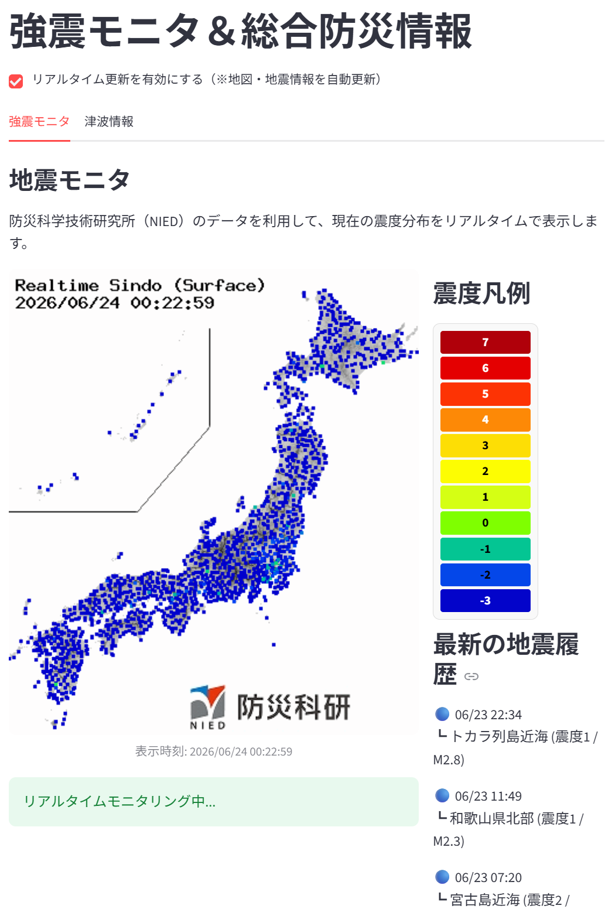
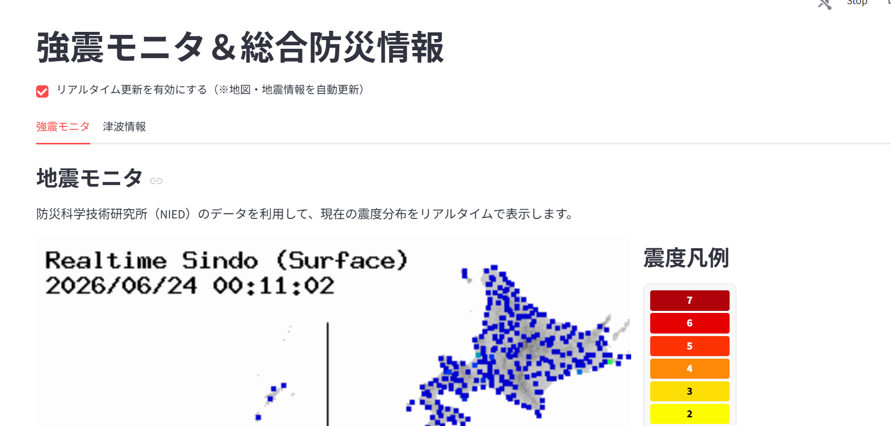

# リアルタイム強震モニタ＆総合防災情報アプリ

## 概要
防災科学技術研究所（NIED）や気象庁などの外部APIを活用し、現在の震度分布、直近の地震履歴、および津波情報をリアルタイムで可視化・集約するWebアプリケーションです。

---

## 画面イメージ

<table>
  <tr>
    <td align="center" valign="top" width="50%">
      <b>強震モニタ画面</b>  
      
    </td>
    <td align="center" valign="top" width="50%">
      <b>津波情報画面（※デモ版画面）</b>  
      
    </td>
  </tr>
</table>

---

## 使用技術

### 開発環境・言語
- **フレームワーク:** Streamlit
- **主要ライブラリ:** `requests`, `Pillow`

### 利用データ（外部API）
- **防災科学技術研究所（NIED）:** 強震モニタリアルタイム画像
- **気象庁:** 地震情報リスト（JSON）
- **P2P地震情報 API:** 津波注意報・警報データ